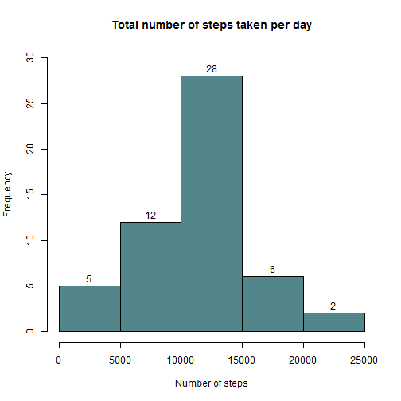
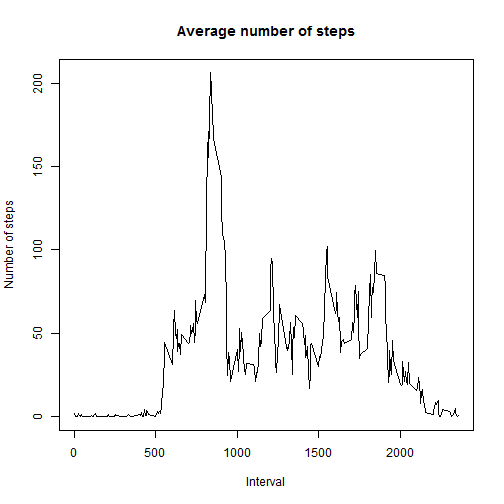
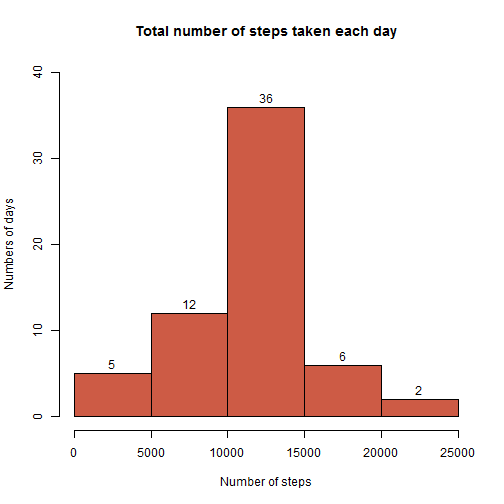

## Loading and preprocessing the data

The [data](https://d396qusza40orc.cloudfront.net/repdata%2Fdata%2Factivity.zip) for this assignment can be downloaded from the course web site.

The variables included in this dataset are:

+ **steps**: Number of steps taking in a 5-minute interval (missing values are coded as `NA`).

+ **date**: The date on which the measurement was taken in YYYY-MM-DD format.

+ **interval**: Identifier for the 5-minute interval in which measurement was taken.

The dataset is stored in a comma-separated-value (CSV) file and there are a total of 17,568 observations in this dataset.


```r
#In the repository is the activity.zip file. Then I'll comment this code and I'll use other easier.
#if(!file.exists("activity.csv")) {
#        temp <- tempfile()
#        download.file("https://d396qusza40orc.cloudfront.net/repdata%2Fdata%2Factivity.zip",temp)
#        unzip(temp)
#        unlink(temp)
#}
unzip("activity.zip")
activity <- read.csv("activity.csv")
```

## What is mean total number of steps taken per day?

For this part of the assignment, you can ignore the missing values in the dataset.

1. Make a histogram of the total number of steps taken each day.

    
    ```r
    steps_by.day <- aggregate(steps ~ date, data=activity, FUN=sum)
    hist(steps_by.day$steps, main="Total number of steps taken per day", col="cadetblue4",
      xlab="Number of steps", xlim=c(0,25000), ylim=c(0,30), labels=TRUE)
    ```
    
     

2. Calculate and report the **mean** and **median** total number of steps taken per day.
    
    ```r
    rmean <- mean(steps_by.day$steps)
    rmedian <- median(steps_by.day$steps)
    ```
    The media is **1.0766189 &times; 10<sup>4</sup>** and the median is **10765**.

## What is the average daily activity pattern?

1. Make a time series plot (i.e. type = "l") of the 5-minute interval (x-axis) and the average number of steps taken, averaged across all days (y-axis).

    
    ```r
    steps_by.interval <- aggregate(steps ~ interval, data=activity, FUN=mean)
    plot(steps_by.interval$interval, steps_by.interval$steps, type="l",
      main="Average number of steps", xlab="Interval", ylab="Number of steps")
    ```
    
     

2. Which 5-minute interval, on average across all the days in the dataset, contains the maximum number of steps?
    
    ```r
    minterval <- steps_by.interval[which.max(steps_by.interval$steps), 1]
    ```
    The 5-minute interval, on average across all the days in the data set, containing the maximum number of steps is **835**.

## Imputing missing values

Note that there are a number of days/intervals where there are missing values (coded as `NA`). The presence of missing days may introduce bias into some calculations or summaries of the data.

1. Calculate and report the total number of missing values in the dataset (i.e. the total number of rows with `NAs`)
    
    ```r
    num_missing <- sum(is.na(activity))
    ```
    The total number of missing values is **2304**.


2. Devise a strategy for filling in all of the missing values in the dataset. The strategy does not need to be sophisticated. For example, you could use the mean/median for that day, or the mean for that 5-minute interval, etc.

    The average of the 5-minute intervals was used as filler elements.
    
3. Create a new dataset that is equal to the original dataset but with the missing data filled in.
    
    ```r
    activity2 <- merge(activity, steps_by.interval, by.x="interval", by.y="interval", suffixes=c("", ".interval"))
    i <- is.na(activity2$steps)
    activity2$steps[i] <- activity2$steps.interval[i]
    activity2 <- activity2[,c(1:3)]
    ```
    
4. Make a histogram of the total number of steps taken each day and Calculate and report the **mean** and **median** total number of steps taken per day. Do these values differ from the estimates from the first part of the assignment? What is the impact of imputing missing data on the estimates of the total daily number of steps?
    
    ```r
    steps_by2.day <- aggregate(steps ~ date, data=activity2, FUN=sum)
    hist(steps_by2.day$steps, main="Total number of steps taken each day", col="coral3",
      xlab="Number of steps", ylab="Numbers of days", 
      xlim=c(0,25000), ylim=c(0,40), labels=TRUE)
    ```
    
     
    
    ```r
    rmean2 <- mean(steps_by2.day$steps)
    rmedian2 <- mean(steps_by2.day$steps)
    d_mean <- rmean2 - rmean
    d_median <- rmedian2 - rmedian
    d_steps <- sum(steps_by2.day$steps) - sum(steps_by.day$steps)
    ```
    The media is **1.0766189 &times; 10<sup>4</sup>** and the median is **1.0766189 &times; 10<sup>4</sup>**.  
      
    The differ between means is **0** and between medians is **1.1886792**.  
      
    The total differ between steps is **8.6129509 &times; 10<sup>4</sup>**.
      
## Are there differences in activity patterns between weekdays and weekends?  
For this part the weekdays() function may be of some help here. Use the dataset with the filled-in missing values for this part.    

1. Create a new factor variable in the dataset with two levels -- "weekday" and "weekend" indicating whether a given date is a weekday or weekend day.
    
    ```r
    #Set time locale to English. In my environment it's in Spanish. 
    #If I want show "days of week" in English I must set time locale to English.
    old_locale <- Sys.getlocale("LC_TIME")
    s <- Sys.setlocale("LC_TIME", "English")
    
    daytype <- function(date) {
       if (weekdays(as.Date(date)) %in% c("Saturday", "Sunday")) {
           "weekend"
       } else {
           "weekday"
       }
    }
    activity2$daytype <- as.factor(sapply(activity2$date, daytype))
    #Set time locale to my original locale.
    s <- Sys.setlocale("LC_TIME", old_locale) 
    ```

2. Make a panel plot containing a time series plot (i.e. type = "l") of the 5-minute interval (x-axis) and the average number of steps taken, averaged across all weekday days or weekend days (y-axis).
    
    ```r
    steps_by2.type <- aggregate(steps ~ interval + daytype, data=activity2, FUN=mean)
    library(lattice)
    xyplot(steps_by2.type$steps ~ steps_by2.type$interval | steps_by2.type$daytype, xlab="Interval", ylab="Number of steps", layout=c(1,2), type="l")
    ```
    
     
